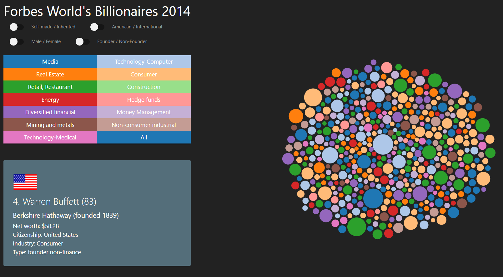

# Data Visualization of the Forbes Billionaire List 2014

  

  

An interactive data visualization of the world's 500 richest billionaires as listed by Forbes in 2014.

The dataset used for this visualization comes from the following study by Caroline Freund and Sarah Oliver: https://piie.com/publications/working-papers/origins-superrich-billionaire-characteristics-database?ResearchID=2917.
The data is available at the link as an Excel spreadsheet, which I converted to JSON for the purposes of this project. This JSON file is hosted online using Github pages, but I also included it in the repository for easy reference.
